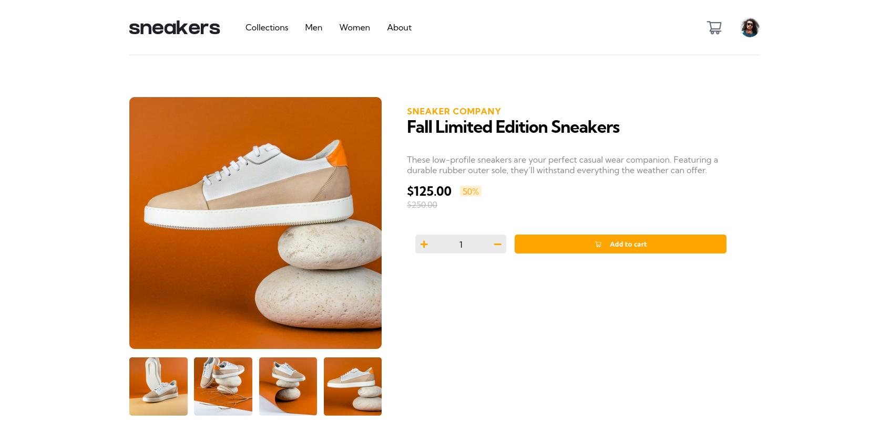
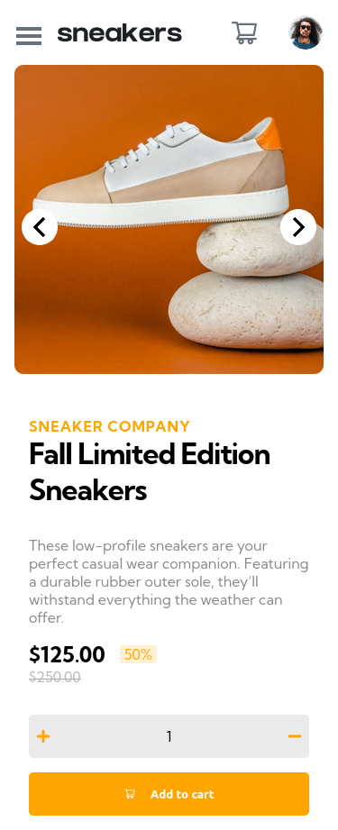

# Tip Calculator Build With React

## Table of contents

- [Overview](#overview)
- [The challenge](#the-challenge)
- [Links](#links)
- [Screenshot](#screenshot)
- [Built with](#built-with)
- [Author](#author)

## Overview
E-commerce product page challenge hub build using React.

## Links

- Live Site URL: [click-me](https://jovial-bassi-ddb0b4.netlify.app/)

## Screenshot
- Desktop

- Mobile

## Built with

- React
- Semantic HTML5 markup
- CSS custom properties
- Flexbox
- CSS Grid
- Mobile-first workflow

## Author

- Frontend Mentor - [@MohamedB ehhar](https://www.frontendmentor.io/profile/MohamedBehhar)
- Github - [@Mohamed Behhar](https://github.com/MohamedBehhar)